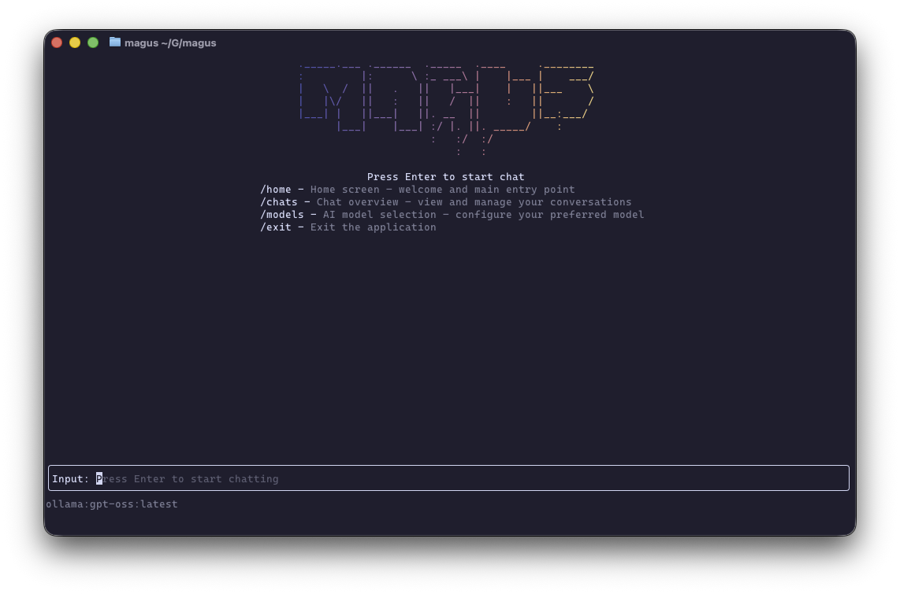
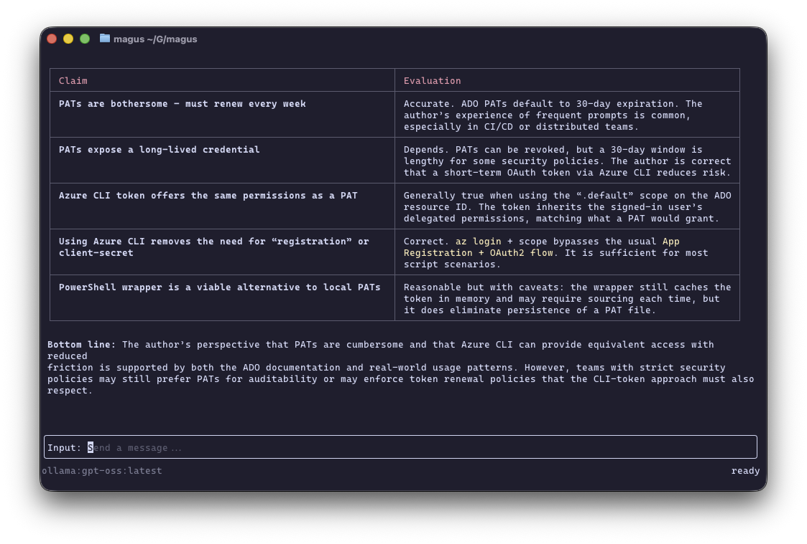
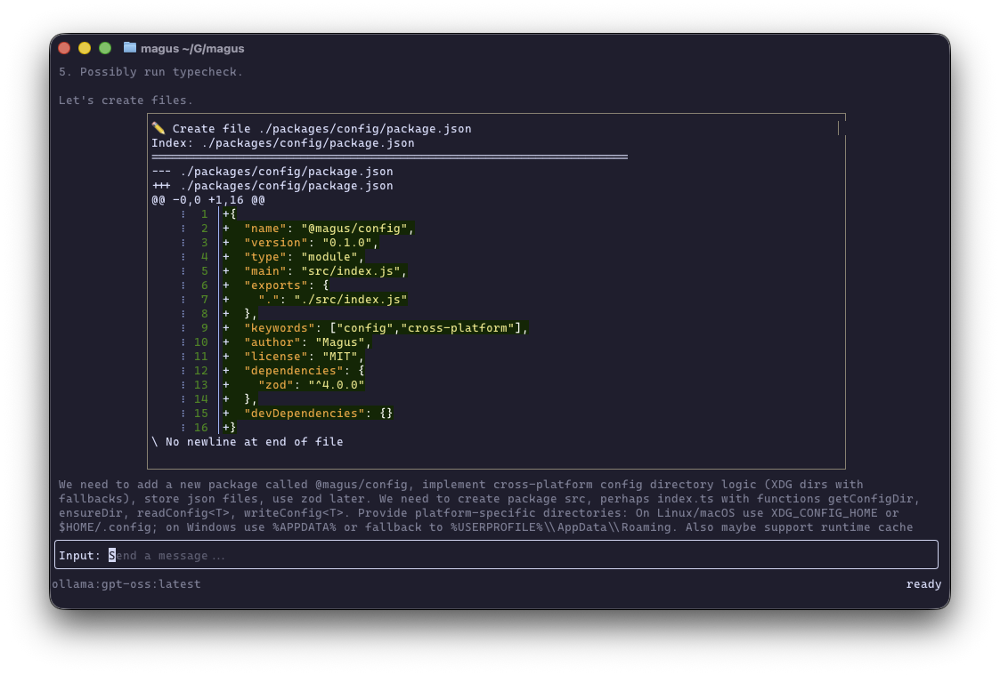

# Magus

[](https://github.com/scaryrawr/magus/actions/workflows/ci.yml)

Magus is a personal CLI AI project heavily inspired by [sst/opencode](https://github.com/sst/opencode) and the CLI agent trend.

It is under heavy development and not yet stable.

If you're looking for a complete tool, I heavily recommend opencode, this tool is more of a personal project for developing and figuring out LLM based tools.

Also! [copilot-cli](https://github.com/github/copilot-cli) is now in Public Preview (so I recommend checking that out too instead of this personal project).







## Project Structure

This monorepo contains multiple packages and applications:

### Apps

- `apps/magus` - The main Magus application

### Packages

- `packages/common-utils` - Shared lightweight utility helpers
- `packages/config` - User config/cache/data schema + persistence
- `packages/providers` - AI provider integrations
- `packages/react` - Ink/React components and hooks
- `packages/react-tools` - Tool interaction Ink components
- `packages/server` - Hono server exposing model + chat routes
- `packages/tools` - Core tool implementations (grep, editor, shell, etc.)

## Optional Dependencies

| Binary                     | Purpose                                                          |
| -------------------------- | ---------------------------------------------------------------- |
| **rg** (ripgrep)           | Fast pattern searching. Used as the primary grep implementation. |
| **fd**                     | Fast file finder for recursive file discovery.                   |
| **pwsh** (PowerShell Core) | Used for file discovery on Windows and as a possible shell.      |
| **zsh**                    | Preferred POSIX shell for persistent sessions.                   |
| **bash**                   | Fallback POSIX shell.                                            |
| **sh**                     | Generic fallback shell.                                          |
| **delta**                  | Pretty diff rendering. Used if available.                        |
| **bat**                    | Fallback pretty diff renderer.                                   |
| **az** (Azure CLI)         | Required for Azure provider integration.                         |

The following external binaries are optionally used by Magus. They are not required for the core functionality, but certain features (such as advanced search, file discovery, or pretty diff rendering) will fall back to built‑in implementations when they are not present.

| Binary                     | Purpose                                                          |
| -------------------------- | ---------------------------------------------------------------- |
| **rg** (ripgrep)           | Fast pattern searching. Used as the primary grep implementation. |
| **fd**                     | Fast file finder for recursive file discovery.                   |
| **pwsh** (PowerShell Core) | Used for file discovery on Windows and as a possible shell.      |
| **zsh**                    | Preferred POSIX shell for persistent sessions.                   |
| **bash**                   | Fallback POSIX shell.                                            |
| **sh**                     | Generic fallback shell.                                          |
| **delta**                  | Pretty diff rendering. Used if available.                        |
| **bat**                    | Fallback pretty diff renderer.                                   |

If any of these binaries are missing, Magus will automatically fall back to pure‑JavaScript/Node implementations, ensuring the CLI continues to work.

## Getting Started

### Prerequisites

- Bun (v1.0 or higher)

### Installation

```bash
# Install dependencies
bun install

# Build all packages
bun run build
```

## Available Scripts

- `bun run build` - Build all packages
- `bun run test` - Run tests across all packages
- `bun run test:coverage` - Run tests with coverage
- `bun run typecheck` - Type check all packages (via `tsgo` / TypeScript native preview)
- `bun run lint` - Lint all files
- `bun run format` - Format code with Prettier
